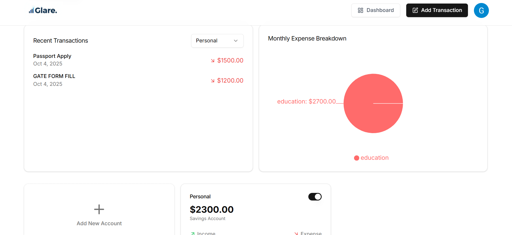
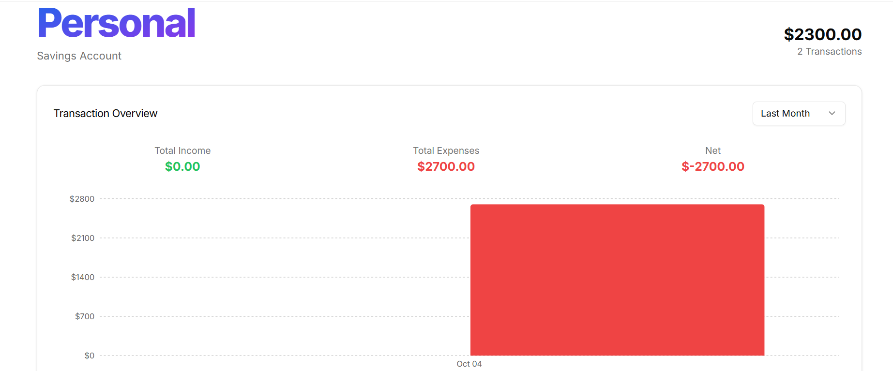
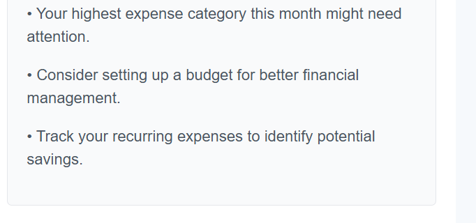
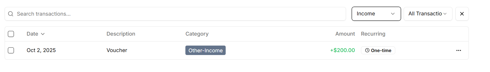
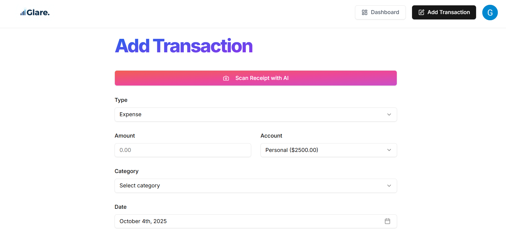

<div align="center">

# 💸 **AI-Powered Finance Platform**
### *Next-Generation Financial Intelligence & Analytics*

**Check it out at : https://ai-powered-finance-platform.vercel.app/**

<p align="center">
  
  
  
  
  
</p>

<p align="center">
  
  
</p>

> 🚀 **Experience the future of personal finance management** with cutting-edge AI technology, seamless user experience, and enterprise-grade security. Built with modern web technologies for scalability, performance, and intelligent financial insights.


</div>

---

## 🎯 **Project Overview**

<div align="center">

### 🌟 **Revolutionary Finance Platform Architecture**

</div>
<table align="center">
<tr>
<td align="center" width="25%">
<h4>🎨 <strong>Frontend</strong></h4>
<p>⚡ Next.js 14 (App Router)<br/>
🎯 Modern React Architecture</p>
</td>
<td align="center" width="25%">
<h4>🗄️ <strong>Backend & Auth</strong></h4>
<p>🔐 Supabase Integration<br/>
👤 Clerk Authentication</p>
</td>
<td align="center" width="25%">
<h4>💾 <strong>Database</strong></h4>
<p>🛡️ Prisma ORM<br/>
📊 Type-safe Database Access</p>
</td>
<td align="center" width="25%">
<h4>🎭 <strong>UI/UX</strong></h4>
<p>🎨 Tailwind CSS<br/>
✨ Shadcn UI Components</p>
</td>
</tr>
</table>

### 🤖 **AI-Powered Intelligence**
<table align="center">
<tr>
<td align="center" width="33%">
<h4>🧠 <strong>Smart Analysis</strong></h4>
<p>🤖 Google Gemini API<br/>
📈 Financial Pattern Recognition</p>
</td>
<td align="center" width="33%">
<h4>⚡ <strong>Background Processing</strong></h4>
<p>🔄 Inngest Serverless Jobs<br/>
📅 Automated Insights</p>
</td>
<td align="center" width="33%">
<h4>🛡️ <strong>Monitoring</strong></h4>
<p>👁️ ArcJet Observability<br/>
📧 Resend Email Service</p>
</td>
</tr>
</table>

> ✨ **This revolutionary platform** empowers users to gain deep insights into their finances using AI, securely store sensitive data, and receive personalized suggestions or automated summaries via intelligent email notifications.

---

## 🚀 **Features**

<div align="center">

### 💫 **Comprehensive Feature Suite**

</div>

<table>
<tr>
<td align="center" width="50%">
<h3>🤖 <strong>AI Intelligence</strong></h3>
<ul align="left">
<li>✅ <strong>Smart Financial Analysis</strong> using Gemini AI</li>
<li>✅ <strong>Predictive Budgeting</strong> recommendations</li>
<li>✅ <strong>Expense Pattern Recognition</strong></li>
<li>✅ <strong>Automated Insights Generation</strong></li>
</ul>
</td>
<td align="center" width="50%">
<h3>🔐 <strong>Security & Auth</strong></h3>
<ul align="left">
<li>✅ <strong>Enterprise-grade Authentication</strong> with Clerk</li>
<li>✅ <strong>Secure Data Encryption</strong></li>
<li>✅ <strong>Multi-factor Authentication</strong></li>
<li>✅ <strong>Privacy-first Architecture</strong></li>
</ul>
</td>
</tr>
<tr>
<td align="center" width="50%">
<h3>⚡ <strong>Performance & Scale</strong></h3>
<ul align="left">
<li>✅ <strong>Event-driven Background Tasks</strong> with Inngest</li>
<li>✅ <strong>Edge-optimized Deployment</strong></li>
<li>✅ <strong>Type-safe Database Queries</strong> with Prisma</li>
<li>✅ <strong>Real-time Data Synchronization</strong></li>
</ul>
</td>
<td align="center" width="50%">
<h3>📱 <strong>User Experience</strong></h3>
<ul align="left">
<li>✅ <strong>Modern Responsive Design</strong> (Shadcn + Tailwind)</li>
<li>✅ <strong>Custom Financial Dashboards</strong></li>
<li>✅ <strong>Automated Email Notifications</strong> via Resend</li>
<li>✅ <strong>Intuitive Navigation</strong> & UI/UX</li>
</ul>
</td>
</tr>
</table>

---

## ⚙️ **Getting Started**

<div align="center">

### 🚀 **Quick Setup Guide**

</div>

### **1️⃣ Clone the Repository**
```bash
git clone https://github.com/gagan-1307/ai-finance-platform.git
cd ai-finance-platform
```

### **2️⃣ Install Dependencies**
```bash
npm install
# or
yarn install
```

### **3️⃣ Environment Configuration**

<details>
<summary><strong>🔧 Required Environment Variables</strong></summary>

Create a `.env` file in the root directory with the following variables:

```env
# 🗄️ Database Configuration
DATABASE_URL=your_database_connection_url
DIRECT_URL=your_direct_connection_url

# 🔐 Authentication (Clerk)
NEXT_PUBLIC_CLERK_PUBLISHABLE_KEY=your_clerk_publishable_key
CLERK_SECRET_KEY=your_clerk_secret_key
NEXT_PUBLIC_CLERK_SIGN_IN_URL=/sign-in
NEXT_PUBLIC_CLERK_SIGN_UP_URL=/sign-up
NEXT_PUBLIC_CLERK_AFTER_SIGN_IN_URL=/onboarding
NEXT_PUBLIC_CLERK_AFTER_SIGN_UP_URL=/onboarding

# 🤖 AI Integration
GEMINI_API_KEY=your_google_gemini_api_key

# 📧 Email Services
RESEND_API_KEY=your_resend_api_key

# 👁️ Monitoring & Analytics
ARCJET_KEY=your_arcjet_key
```

> ⚠️ **Security Note**: Never commit your `.env` file to version control!

</details>

### **4️⃣ Database Setup**
```bash
# Generate Prisma client
npx prisma generate

# Run database migrations
npx prisma db push

# (Optional) Seed the database
npm run db:seed
```

### **5️⃣ Start Development Server**
<table align="center">
<tr>
<td align="center">
<h4>🌐 <strong>Main Application</strong></h4>
<pre><code>npm run dev</code></pre>
<p><em>Runs on http://localhost:3000</em></p>
</td>
<td align="center">
<h4>⚡ <strong>Background Jobs</strong></h4>
<pre><code>npx inngest dev</code></pre>
<p><em>Inngest development server</em></p>
</td>
</tr>
</table>

---

## 🛠️ **Technology Stack**

<div align="center">

### 💻 **Modern Development Arsenal**

</div>

### **🎨 Frontend Technologies**
<div align="center">
<table>
<tr>
<td align="center">

<br><strong>Next.js 14</strong>
<br><em>App Router & SSR</em>
</td>
<td align="center">

<br><strong>Tailwind CSS</strong>
<br><em>Utility-first Styling</em>
</td>
<td align="center">

<br><strong>Shadcn UI</strong>
<br><em>Component Library</em>
</td>
<td align="center">

<br><strong>TypeScript</strong>
<br><em>Type Safety</em>
</td>
</tr>
</table>
</div>

### **⚙️ Backend & Infrastructure**
<div align="center">
<table>
<tr>
<td align="center">

<br><strong>Supabase</strong>
<br><em>Backend as a Service</em>
</td>
<td align="center">

<br><strong>Prisma ORM</strong>
<br><em>Database Toolkit</em>
</td>
<td align="center">

<br><strong>Inngest</strong>
<br><em>Background Jobs</em>
</td>
</tr>
</table>
</div>

### **🔐 Authentication & Security**
<div align="center">
<table>
<tr>
<td align="center">

<br><strong>Clerk Auth</strong>
<br><em>Authentication Service</em>
</td>
<td align="center">

<br><strong>ArcJet</strong>
<br><em>AI Observability</em>
</td>
</tr>
</table>
</div>

### **🤖 AI & Communication**
<div align="center">
<table>
<tr>
<td align="center">

<br><strong>Google Gemini</strong>
<br><em>AI Analysis Engine</em>
</td>
<td align="center">

<br><strong>Resend API</strong>
<br><em>Email Delivery</em>
</td>
</tr>
</table>
</div>

---

## 🧠 **AI Integration (Gemini)**

<div align="center">

### 🤖 **Intelligent Financial Analysis**

</div>

<table>
<tr>
<td align="center" width="50%">
<h4>📊 <strong>Smart Analytics</strong></h4>
<ul align="left">
<li>🔍 <strong>Transaction Analysis</strong> - Pattern recognition in spending</li>
<li>📈 <strong>Trend Identification</strong> - Historical data insights</li>
<li>🎯 <strong>Anomaly Detection</strong> - Unusual spending alerts</li>
<li>💡 <strong>Predictive Modeling</strong> - Future expense forecasting</li>
</ul>
</td>
<td align="center" width="50%">
<h4>💰 <strong>Personalized Recommendations</strong></h4>
<ul align="left">
<li>💳 <strong>Smart Budgeting</strong> - AI-driven budget suggestions</li>
<li>🏆 <strong>Savings Optimization</strong> - Maximize saving potential</li>
<li>📊 <strong>Expense Categorization</strong> - Auto-categorize transactions</li>
<li>📅 <strong>Monthly Insights</strong> - Comprehensive financial reports</li>
</ul>
</td>
</tr>
</table>

### 💬 **Example AI Insights**

<div align="center">

<blockquote>
💡 <strong>"Based on your spending patterns, we recommend reducing dining expenses by 12% this month to meet your savings goal."</strong>
</blockquote>

<blockquote>
🎯 <strong>"Your utility costs have increased 23% compared to last quarter. Consider energy-saving measures to optimize expenses."</strong>
</blockquote>

</div>

---

## 📨 **Email Automation (Resend)**

<div align="center">

### 📬 **Intelligent Communication System**

</div>

<table>
<tr>
<td align="center" width="25%">
<h4>🎉 <strong>Welcome Series</strong></h4>
<p>✅ Signup confirmations<br/>
🎯 Onboarding guidance<br/>
📖 Feature introductions</p>
</td>
<td align="center" width="25%">
<h4>📊 <strong>Regular Reports</strong></h4>
<p>📅 Weekly summaries<br/>
📈 Monthly analytics<br/>
🏆 Achievement notifications</p>
</td>
<td align="center" width="25%">
<h4>💰 <strong>Budget Alerts</strong></h4>
<p>⚠️ Spending warnings<br/>
🎯 Goal reminders<br/>
💡 Optimization tips</p>
</td>
<td align="center" width="25%">
<h4>🤖 <strong>AI Insights</strong></h4>
<p>🧠 Smart recommendations<br/>
📊 Trend analyses<br/>
💎 Personalized advice</p>
</td>
</tr>
</table>

---

## ⏱️ **Background Jobs (Inngest)**

<div align="center">

### ⚡ **Serverless Task Management**

</div>

<table>
<tr>
<td align="center" width="33%">
<h4>🔄 <strong>Data Processing</strong></h4>
<ul align="left">
<li>📊 Periodic data synchronization</li>
<li>🔍 Transaction categorization</li>
<li>📈 Financial metric calculations</li>
<li>🧹 Data cleanup & optimization</li>
</ul>
</td>
<td align="center" width="33%">
<h4>📧 <strong>Communication</strong></h4>
<ul align="left">
<li>⏰ Scheduled email dispatches</li>
<li>🚨 Real-time alert notifications</li>
<li>📊 Report generation & delivery</li>
<li>🎯 Personalized content creation</li>
</ul>
</td>
<td align="center" width="33%">
<h4>🤖 <strong>AI Processing</strong></h4>
<ul align="left">
<li>🧠 Background AI analysis tasks</li>
<li>📊 Insight generation workflows</li>
<li>🔮 Predictive model updates</li>
<li>� Recommendation engine jobs</li>
</ul>
</td>
</tr>
</table>

---

## �🛡️ **Observability (ArcJet)**

<div align="center">

### 👁️ **Advanced Monitoring & Security**

</div>

<table>
<tr>
<td align="center" width="50%">
<h4>📊 <strong>Performance Monitoring</strong></h4>
<ul align="left">
<li>🔍 <strong>AI Interaction Tracing</strong> - Monitor AI API calls</li>
<li>⚡ <strong>Latency Tracking</strong> - Response time optimization</li>
<li>🚨 <strong>Error Detection</strong> - Real-time error monitoring</li>
<li>📈 <strong>Usage Analytics</strong> - Platform performance metrics</li>
</ul>
</td>
<td align="center" width="50%">
<h4>🔐 <strong>Security & Compliance</strong></h4>
<ul align="left">
<li>🛡️ <strong>Secure Model Usage</strong> - AI API security</li>
<li>🔒 <strong>Access Control</strong> - User permission tracking</li>
<li>📝 <strong>Audit Logging</strong> - Comprehensive activity logs</li>
<li>⚠️ <strong>Threat Detection</strong> - Security anomaly alerts</li>
</ul>
</td>
</tr>
</table>

---

## 📸 **Screenshots & Demo**

<div align="center">

### 🎨 **Visual Experience**

<!-- Top row: main feature screenshots -->
<p align="center">
  
  
  
</p>

<!-- Secondary row: mobile / detail views -->
<p align="center">
  
  
</p>

<!-- Feature summary table -->
<table>
<tr>
<td align="center"><strong>💳 Transactions</strong></td>
<td align="center"><strong>💰 Budget Management</strong></td>
<td align="center"><strong>⚙️ Settings</strong></td>
</tr>
<tr>
<td align="center">📋 <em>Transaction history & categorization</em></td>
<td align="center">🎯 <em>Budget creation & tracking</em></td>
<td align="center">🔧 <em>Profile & preference management</em></td>
</tr>
</table>

</div>

---

## 🧪 **Development & Testing**

<div align="center">

### 🔧 **Developer Toolkit**

</div>

<table>
<tr>
<td align="center" width="25%">
<h4>🗄️ <strong>Database</strong></h4>
<p>🔍 <code>npx prisma studio</code><br/>
<em>Visual database browser</em></p>
</td>
<td align="center" width="25%">
<h4>🌐 <strong>Development</strong></h4>
<p>⚡ <code>npm run dev</code><br/>
<em>Start development server</em></p>
</td>
<td align="center" width="25%">
<h4>⚡ <strong>Background Jobs</strong></h4>
<p>🔄 <code>npx inngest dev</code><br/>
<em>Inngest development listener</em></p>
</td>
<td align="center" width="25%">
<h4>📧 <strong>Email Testing</strong></h4>
<p>✉️ <code>npm run test:email</code><br/>
<em>Send test emails with mock data</em></p>
</td>
</tr>
</table>

### 🚀 **Deployment Commands**

<details>
<summary><strong>📦 Production Deployment</strong></summary>

```bash
# Build the application
npm run build

# Start production server
npm start

# Database migrations for production
npx prisma migrate deploy

# Generate optimized Prisma client
npx prisma generate --no-engine
```

</details>

<details>
<summary><strong>🧪 Testing & Quality Assurance</strong></summary>

```bash
# Run test suite
npm test

# Type checking
npm run type-check

# Linting
npm run lint

# Format code
npm run format
```

</details>

---

## 🤝 **Contributing**

<div align="center">

### 🚀 **Join Our Development Community**

</div>

<table>
<tr>
<td align="center" width="50%">
<h4>🍴 <strong>Getting Started</strong></h4>
<ol align="left">
<li>Fork the repository</li>
<li>Create your feature branch</li>
<li>Make your changes</li>
<li>Test thoroughly</li>
<li>Submit a pull request</li>
</ol>
</td>
<td align="center" width="50%">
<h4>📋 <strong>Guidelines</strong></h4>
<ul align="left">
<li>🎯 Follow TypeScript best practices</li>
<li>📝 Write comprehensive tests</li>
<li>📖 Update documentation</li>
<li>🎨 Maintain code style consistency</li>
</ul>
</td>
</tr>
</table>
